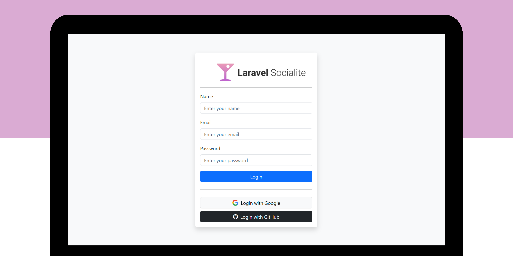

## 🛠️ Project Installation Guide

Following are the steps to install a Laravel project:

### Prerequisites

Make sure you have [Node.js](https://nodejs.org/) and [Composer](https://getcomposer.org/) installed on your system before starting the installation.

### Steps

**1.** Clone your Laravel project repository into a local directory:

```bash
git clone https://github.com/ramadhanabelio/login-with-socialite.git
```

**2.** Go to the project directory:

```bash
cd login-with-socialite
```

**3.** Install JavaScript dependencies using npm:

```bash
npm install
```

**4.** Install PHP dependencies using composer:

```bash
composer install
```

**5.** Rename the .env.example file to .env. This is the Laravel configuration file:

**Linux, macOS:**

```bash
mv .env.example .env
```

**Windows:**

```bash
cp .env.example .env
```

**6.** Create a database with a name according to your project, for example "login_with_socialite", and configure the .env file to set the database name:

Open the .env file using a text editor and find the following line:

```bash
DB_DATABASE=laravel
```

Replace database_name with the name you used for the database. For example:

```bash
DB_DATABASE=login_with_socialite
```

**7.** Generate application key:

```bash
php artisan key:generate
```

**8.** Create and migrate database (in this case, we use migrate:fresh to delete and repopulate database data):

```bash
php artisan migrate:fresh --seed
```

**9.** Run the Laravel development server:

```bash
php artisan serve
```

After following the steps above, your Laravel project is now ready to use and can be accessed via the browser at http://localhost:8000.
